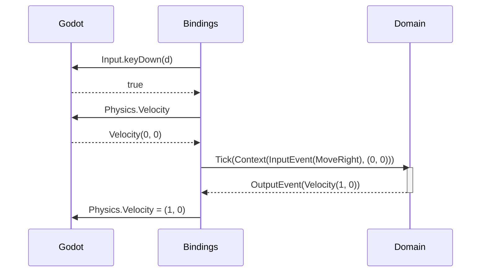
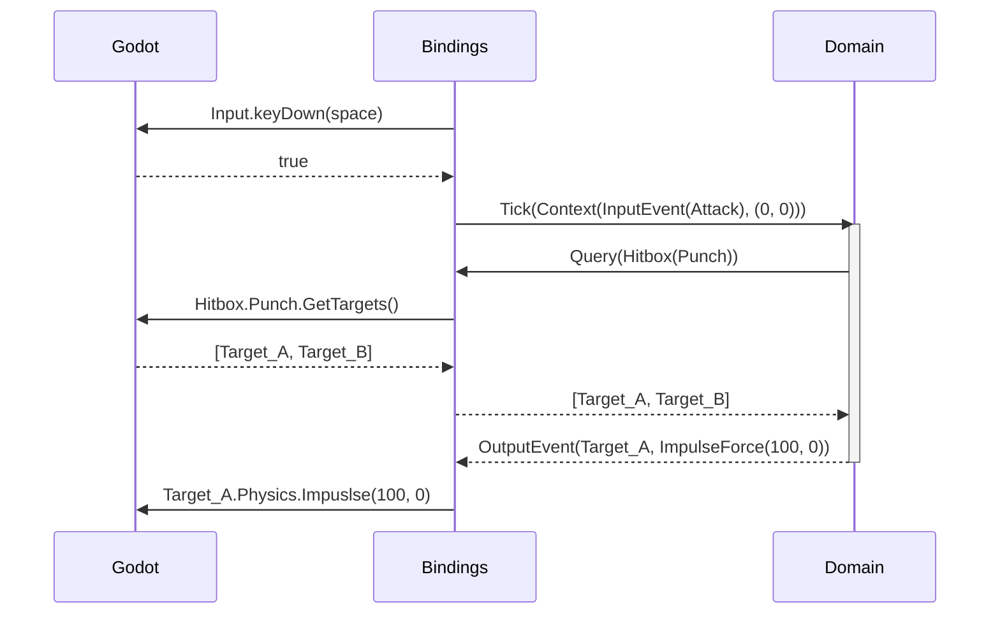
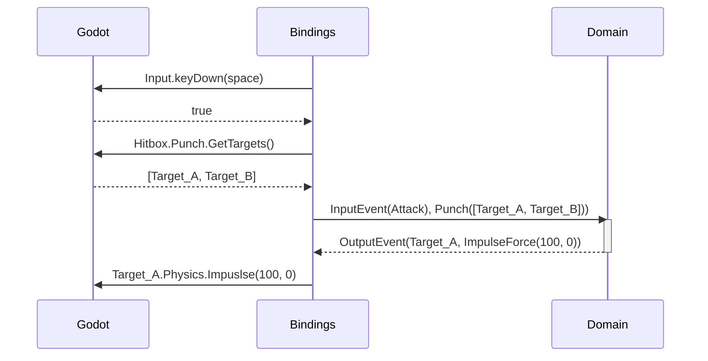


# Problem

An application architecture is needed to separate concerns and responsibilities.

# Responsibility segregation

## Domain
The domain handles all the game logic, to the maximum extent possible. It will
greedily store game state. Some state must be stored in the engine, such as physics data,
because we will not be implementing our own physics engine.

The domain is exposed as a single Tick() function which is called every frame
and accepts a context object which contains all input and external state (physics, time).
The function returns a list of events to be executed and rendered by the bindings.

The domain is responsible for:
- Actions
- Mapping data (velocity, hitbox members, input, etc.) into Events/Commands
- EX: mapping (press right) -> (Domain.RightMove action)
- Maintaining internal state
  - EX: facing direciton. attack cooldown. pickups.
  - No internal state is stored which is synced with the engine
  - does NOT store position, velocity, etc.
  - single source of truth for all state: either engine or domain
- interally executes commands/actions
  - EX: SetHealth, AddItem
  - dispatches events/actions out to the bindings to execute
    - SetVelocity
    - Despawn

## Bindings

The bindings are the glue between the domain and the engine. they are responsible for
giving the domain the data it needs, and executing the actions emitted by the domain.

The bindings are responsible for:
- provides access to engine data for the domain
  - physics velocity
  - IsGrounded
  - hitbox queries
- Executes the resulting domain actions emitted.
  - SetVelocity
  - ImpulseForce
  - 
- Interaction access (hitbox query)
- syncing domain with physics system
  - physics velocity
  - IsGrounded
  - optionally position
    - position is often not necessary
- Display syncing
  - facing direcdtion -> sprite flips, hitbox flips, etc.
- Input mapping
  - press right -> map to Domain.RightMove action

## Engine

The engine is the game engine we are using, such as Godot. It provides implementations for
things we do not want to implement ourselves, such as physics simulation, rendering, etc.

In this game, the engine is responsible for:

- physics simulation
  - moveAndSlide
  - collision queries
  - hitbox/hurtbox queries and etc

## State

State is paramount. We must be intentional to maintain a single source of truth for all state.
In general, we want all data to be stored in the domain unless we cannot avoid it. For position
and velocity, we must use the physics engine as the source of truth. Any other approach would
amount to state duplication.

| State            | Source of truth | Used by                 | Description                                                            |
|------------------|-----------------|-------------------------|------------------------------------------------------------------------|
| Velocity         | Physics         | Physics, Domain         | delta position over time                                               |
| Position         | Physics         | Physics                 |                                                                        |
| IsGrounded       | Physics         | Domain                  | if body is resting on ground                                           |
| Health           | Domain          | Domain, Render          | health bar. 0 means dead.                                              |
| Facing Direction | Domain          | Domain, Render, Physics | If a body is facing left or right. Flips sprite and colliders.     |
| Hitbox contents  | Physics         | Domain                  | The entities inside a given hitbox. Used to emit damage events etc |
|                  |                 |                         |                                                                        |
|                  |                 |                         |                                                                        |

# Use case Examples

## Movement

## Combat

For hitboxes, we may want to use re-entrant queries. Generally it is useful to avoid re-entrant
code, but hitbox queries can be expensive. So re-entrant code is accepted, as long as it is exclusively
for data retrieval. We must avoid re-entrant code which allows modification of the engine/binding state.

re-entrant queries:

pre-emptive queries:

