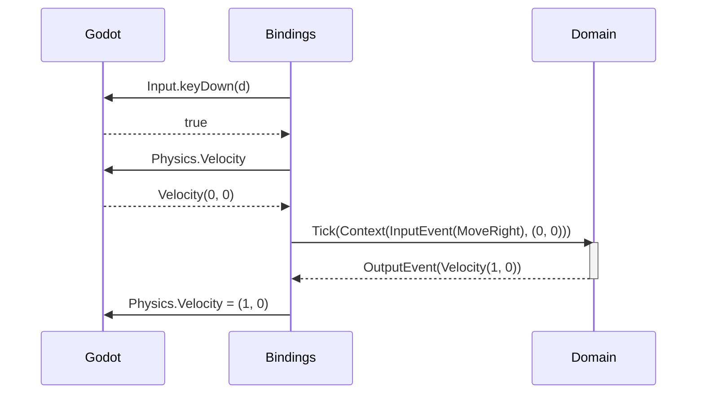
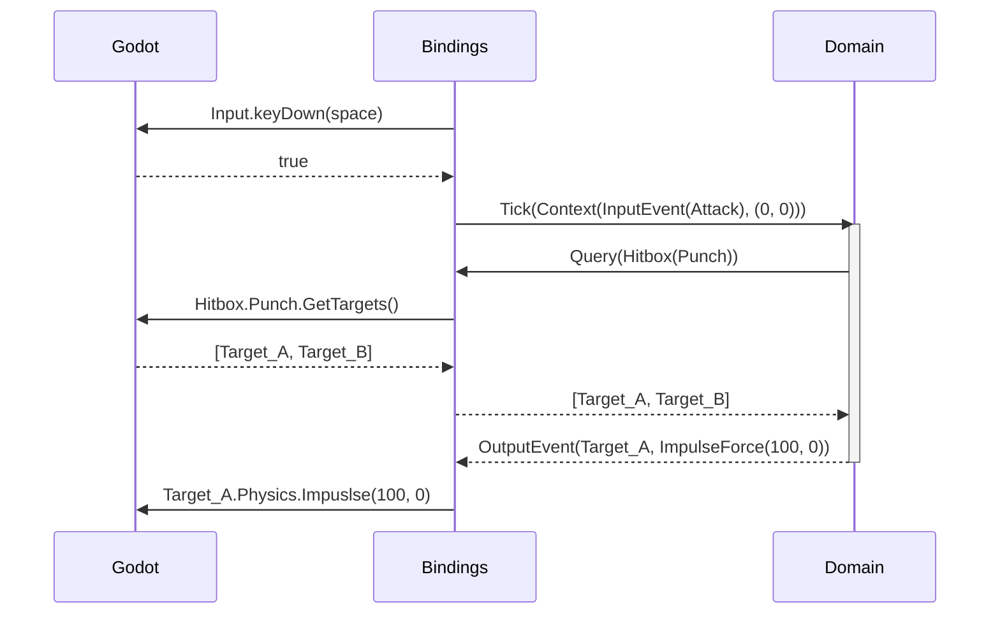


# Responsibility segregation=

- domain
  - Actions
  - Input events -> internal state -> output events
- bindings
  - Interaction access (hitbox query)
  - syncing domain with physics system
    - physics velocity
    - IsGrounded
    - optionally position
      - position is often not necessary
  - Display syncing
    - facing direcdtion -> sprite flips, hitbox flips, etc.
  - Input mapping
    - press right -> map to Domain.RightMove action
- engine (Godot)
  - physics simulation
    - moveAndSlide
    - collision queries
    - hitbox/hurtbox queries and etc

| Interaction | Domain                           | Bindings                                                 | Engine (godot)                   |
|------------|----------------------------------|----------------------------------------------------------|----------------------------------|
| Movement   | domain Input -> Velocity Δ | input key -> domain input physics vel <-> domain vel | keyboard input Physics simulation |

## Movement

## Combat

